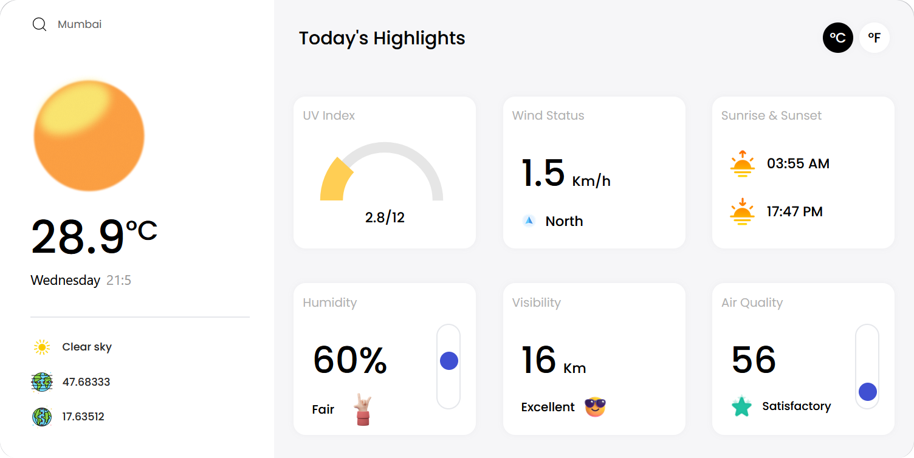

<<<<<<< HEAD
<h1 align="center">WeatherApp</h1>

### <p align="center">Your Ultimate Weather Companion</p>

<div align="center">
<<<<<<< HEAD
  
=======
  
>>>>>>> 4088dc19b5d658e09702146047a7e3c4f6feab20
</div>

## Visit the [Weather App](https://weather-app-ten-mu-45.vercel.app/) website.

## 🌦️ About WeatherApp

WeatherApp is a sleek and intuitive weather application built using React.js and Tailwind CSS. Stay informed about the current weather conditions and forecasts at your fingertips. With a focus on responsiveness and user experience, WeatherApp provides a seamless experience across all screen sizes.

## 🌡️ Features

- **Real-time Weather Data:** Get up-to-date weather information for your location or any city you choose.
- **Temperature Units:** Toggle between Celsius and Fahrenheit to view temperature in your preferred unit.
- **Comprehensive Details:** Access detailed weather data including humidity, visibility, air quality, UV index, wind speed, sunrise, and sunset times.
- **Responsive Design:** Enjoy a consistent and visually appealing experience on devices of all sizes.
- **Search Functionality:** Look up weather information for any city by simply entering the name.

## 📱 User-friendly Interface

WeatherApp features a user-friendly interface that makes it easy for users of all technical levels to access and understand weather data. The app's minimalist aesthetic ensures that you receive crucial weather information without visual clutter.

<div align="center">
<<<<<<< HEAD
  
=======
  
>>>>>>> 4088dc19b5d658e09702146047a7e3c4f6feab20
</div>

## 🚀 Getting Started

1. **Installation:**
   - Clone this repository to your local machine.
   - Navigate to the project directory using your command-line tool.
   - Run `npm install` to install the required dependencies.

2. **Running the App:**
   - After installation, run `npm start dev` to launch the app in your default web browser.

## 🌐 Technologies Used

- ⚛️ **React.js:** A popular JavaScript library for building user interfaces.
- 🎨 **Tailwind CSS:** A utility-first CSS framework for responsive designs.

## 🎉 Acknowledgments

WeatherApp was created with love by Sahil Makadia. Special thanks to the developers of React.js, Tailwind CSS, and the weather API used.

## 📧 Contact

For any inquiries, reach out to us at makadiasahil9846@gmail.com.

<div align="center">
  
---

Stay informed and stay weather-ready with WeatherApp! Your journey into hassle-free weather tracking begins here.

</div>
=======
# weather-winder-application
A weather forecasting website built using React and Tailwind CSS, and API Integration.

# 🌤️ Harsh Patil — Weather Winder Application

This is my custom-built **Weather Finder Web App** developed using **React**, **Tailwind CSS**, and **real-time weather API integration**.  
It’s a sleek, minimal, and responsive application that delivers accurate weather information — crafted from scratch by me.

---

## 🚀 About the Application
The Weather Finder App allows you to:
- 🔍 Search for any city worldwide
- 📡 Fetch **real-time weather data** using an API
- 🌡️ Display temperature, humidity, and weather conditions
- 🎨 Enjoy a **modern UI** built with Tailwind CSS

---

## 🛠️ Tech Stack
- **Framework:** React.js (Functional Components + Hooks)
- **Styling:** Tailwind CSS
- **API:** OpenWeatherMap API (or preferred weather API)
- **HTTP Client:** Fetch API / Axios
- **Deployment:** Vercel / Netlify / GitHub Pages

---

## 📂 Project Structure
```

weather-winder/
│
├── public/
│   ├── index.html
│   └── favicon.ico
│
├── src/
│   ├── components/         # Reusable UI components
│   ├── App.js              # Main App logic
│   ├── index.js            # Entry point
│   ├── App.css             # Tailwind styles
│   └── api/                # API call handling
│
├── package.json
└── README.md

```

---

## 🌐 Live Demo
🔗 **[Try the Weather Finder App](https://your-weather-app-link.com)**

---

## ⚡ Features
- ✅ **Real-time data** from weather API
- ✅ Fully **responsive** design
- ✅ **Error handling** for invalid city names
- ✅ Fast, lightweight, and SEO-friendly

---

## 📜 License & Usage Restrictions
> **Note:** This repository is the intellectual property of **Harsh Patil**.  
> You may not **copy**, **redistribute**, or **claim** this code/design as your own without written permission.  
> Unauthorized use will be considered a violation of copyright laws.

---

## 📧 Contact Me
If you’d like to collaborate, hire me, or just chat:
- **Email:** harshpatil029@example.com
- **GitHub:** [@harshpatil029](https://github.com/harshpatil029)
- **LinkedIn:** [Your LinkedIn Profile]

---

⭐ *Made with passion by Harsh Patil — because even the weather deserves style.*
```

>>>>>>> 09189254737f74295b9c0bacc615d753bde80eee
